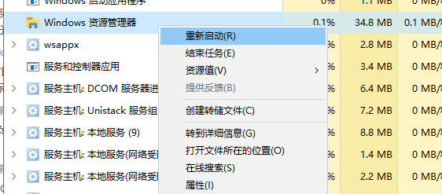
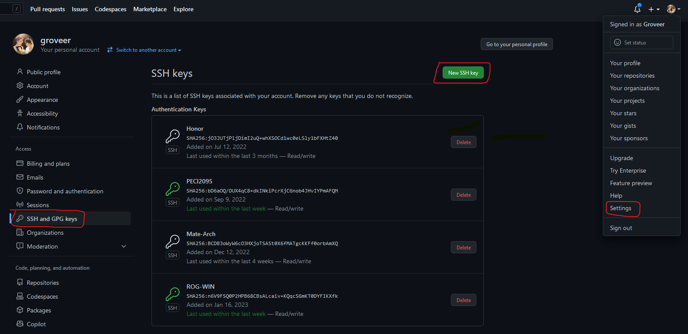

# {{ $frontmatter.title }}

本文章只提供一些不常见的用法，对于 git 基本用法，网上教程很多，这里不再赘述。

## 统计两个 tag 间代码增删情况

```shell
git diff tag1..tag2 --shortstat ':(exclude)translations'
```

## 在 Windows 环境中配置 git 与 github

首先安装 Git，打开 Windows Terminal：

```powershell
winget install Git.Git
```

使用 winget 安装 Git 会自动将 Path 添加进环境变量，但需要重启系统或 Windows 资源管理器：


此时 Git 就可以正常使用了，但想访问 github 还需要进行配置（科学上网），这里自行购买代理或使用机场代理。

```powershell
git config --global https.proxy http://127.0.0.1:7890
```

配置 ssh key，可安装 Windows 可选功能，若无法安装，则可以离线安装[下载地址](https://github.com/PowerShell/Win32-OpenSSH/releases)
若是解压安装，记得将`ssh.exe`所在的路径添加进环境变量；安装完成重启 Windows 资源管理器即可。

执行以下命令生成密钥，连续按`Enter`直到结束，双引号中的字符串可随意替换：

```powershell
ssh-keygen.exe -t ed25519 -C "groveer"
```

执行以下命令获取公钥，并将其添加进 github 的 SSH keys 中，标题可以随便填：

```
cat ~\.ssh\id_ed25519.pub
```



在 Windows 上还需要对本地 ssh 进行配置才可正常访问 github，原因查看[官方文档](https://docs.github.com/zh/authentication/troubleshooting-ssh/using-ssh-over-the-https-port)：

新建`~\.ssh\config`文件，并写入以下内容：

```powershell
Host github.com
Hostname ssh.github.com
Port 443
User git
```

至此，在 Windows 环境中就可以愉快使用 git 和访问 github 了。

## git 配置代理

普通的 https 代理直接使用 shell 中配好的代理即可，这里主要展示使用 ssh 协议时代理设置。

在 Archlinux 中还需要安装一个包才能正常使用：

```bash
sudo pacman -S openbsd-netcat
```

然后在配置文件`~/.ssh/config`中添加以下内容：

```bash
Host github.com
    Hostname ssh.github.com
    User git
    Port 443
    ProxyCommand nc -v -x 127.0.0.1:7890 %h %p
```

> 注意代理地址需改为自己的代理地址！
