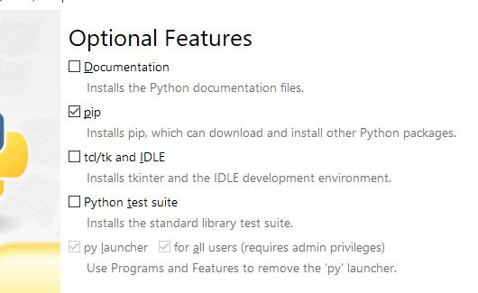
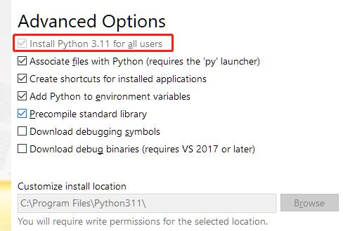
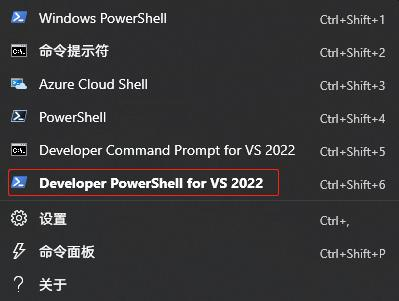

# {{ $frontmatter.title }}

为了与 Linux 拥有一致的开发体验，特在此记录：在 Windows 上使用 Neovim + CMake + MSBuild 搭建 C/C++ 环境。

首先上效果：


> 由于 Neovim 插件和一些配置需要访问[Github](https://github.com/)，若无法访问，请自行百度`科学上网`和`DNS解析`，另不推荐使用镜像站或[Gitee](https://gitee.com/)，因为某些插件可能并没有被同步。

> 本篇文章多次到`环境变量`的设置，关于 Windows 环境变量设置，网上有很多教程，这里不再赘述。

## 系统基础环境配置

可以创建一个目录用来存放工具，并且将这个目录添加进系统环境变量：

```powershell
D:\Program Files\nvim-tools
```

后续所有命令都是在`PowerShell`中执行，`WindowsPowerShell`亦可。记得配置完环境变量后需要重新打开`PowerShell`生效。

### 配置`winget`国内源

```powershell
winget source remove winget
winget source add winget https://mirrors.ustc.edu.cn/winget-source
```

### zip & unzip

1. 下载[附件](rc/unzip-command.zip)
2. 解压后直接丢到`D:\Program Files\nvim-tools`目录即可

### gzip

1. 下载[Binaries](https://gnuwin32.sourceforge.net/packages/gzip.htm)压缩包
2. 解压后将`gzip.exe`放在`D:\Program Files\nvim-tools`目录

### wget

1. 下载[wget.exe](https://eternallybored.org/misc/wget/)
2. 将`wget.exe`放在`D:\Program Files\nvim-tools`目录

### tree-sitter

1. 下载[tree-sitter-windows-x64.gz](https://github.com/tree-sitter/tree-sitter/releases)
2. 解压文件将`tree-sitter.exe`文件放在`D:\Program Files\nvim-tools`目录

### ripgrep

1. 下载[ripgrep](https://github.com/BurntSushi/ripgrep/releases)的 zip 文件
2. 解压文件将`rg.exe`文件放在`D:\Program Files\nvim-tools`目录

### fnm

1. 下载[fnm-windows.zip](https://github.com/Schniz/fnm/releases)
2. 解压文件将`fnm.exe`文件放在`D:\Program Files\nvim-tools`目录

配置 fnm 国内源：

```powershell
explorer.exe $PROFILE
```

打开的文件添加：

```powershell
fnm env --use-on-cd | Out-String | Invoke-Expression
```

重启`PowerShell`，安装 nodejs：

```powershell
fnm install --latest
fnm default 21
fnm use 21
```

配置 nodejs 国内源：

```powershell
npm config set registry https://registry.npmmirror.com/
```

安装 neovim 支持：

```powershell
npm install -g neovim
```

### python

1. 下载[python](https://www.python.org/downloads/)
2. 双击 exe 文件安装

勾选 pip：


勾选所有用户：


> 建议自定义安装，注意勾选`pip`。

配置 pip 国内源：

```powershell
pip config set global.index-url https://pypi.tuna.tsinghua.edu.cn/simple
```

安装 nvim 工具：

```powershell
pip install pynvim
```

### MSBuild

1. 下载[Visual Studio 2022 生成工具](https://visualstudio.microsoft.com/zh-hans/downloads/)
2. 注意**不是**`Visual Studio 2022`，`Visual Studio 2022`是大家熟悉的 IDE
3. 应该往下拉展开`适用于Visual Studio 2022 的工具`，选择`Visual Studio 2022 生成工具`进行下载
   
4. 双击 exe 文件进行安装
5. 在弹出的界面，左侧勾选`使用 C++ 的桌面开发`，右侧按下图勾选即可
   

安装完成后，系统开始菜单应该有`Developer PowerShell for VS 2022`，右键->打开文件位置->右键文件->属性->快捷方式，复制`目标(T):`里面的内容：



```powershell
explorer.exe $PROFILE
```

打开的文件添加刚刚复制的内容，并进行调整，最终结果为：

```powershell
Import-Module "C:\Program Files (x86)\Microsoft Visual Studio\2022\BuildTools\Common7\Tools\Microsoft.VisualStudio.DevShell.dll"
Enter-VsDevShell e344e64a -DevCmdArguments '-arch=x64 -no_logo'
```

其中`-DevCmdArguments`参数是手动添加的，目的是调整架构，为后面编译`Neovim`插件做准备。

最终的配置文件内容：

```powershell
# Install-Module posh-git -Scope CurrentUser
# 引入 git 模块，引入之前需要先执行上面的命令，若报错需要执行：set-executionpolicy remotesigne
Import-Module posh-git
# 添加开发环境
Import-Module "C:\Program Files (x86)\Microsoft Visual Studio\2022\BuildTools\Common7\Tools\Microsoft.VisualStudio.DevShell.dll"
Enter-VsDevShell e344e64a -DevCmdArguments '-arch=x64 -no_logo'
# 设置 Ctrl+D 退出终端
Set-PSReadLineKeyHandler -Key 'Ctrl+d' -Function DeleteCharOrExit
# 设置 fnm 环境变量
fnm env --use-on-cd | Out-String | Invoke-Expression
```

### Neovim

查看[Neovim](https://github.com/neovim/neovim/wiki/Installing-Neovim)官方文档，执行：

```powershell
winget install Neovim.Neovim -s winget
```

### Git

查看[Git](https://git-scm.com/download/win)官方文档，执行：

```powershell
winget install Git.Git -s winget
```

添加`PowerShell` git 支持：

```powershell
Install-Module posh-git -Scope CurrentUser
```

## 开发环境配置

### Git 配置

有时配置 ssh key 之后，每次 clone pull push 的时候还是提示输入密码，可以参考[官方文档](https://docs.github.com/zh/authentication/troubleshooting-ssh/using-ssh-over-the-https-port)
添加`~/.ssh/config`文件，并且写入：

```powershell
Host github.com
Hostname ssh.github.com
Port 443
User git
```

### Neovim 配置

1. Neovim 配置对于刚接触的人可能比较复杂，其实就是配置一些插件，大部分插件的 github 都有其使用说明，这里为了方便，可以直接使用本人的[配置](https://github.com/Groveer/NvChad)，执行：

```powershell
git clone https://github.com/Groveer/NvChad.git
```

2. 创建软件，Neovim 读取配置是在固定的目录，在`cmd`中执行：

按下`Win+r`键，输入`cmd`运行，执行下面的命令：

```cmd
mklink /d C:\Users\Administrator\AppData\Local\nvim D:\Project\NvChad
```

其中，`Administrator`是本地账户名，`D:\Project\nvimdots`是 git clone 下来的项目

> 注意，本条命令要在 cmd 中执行，在 powershell 是没有该命令的！

3. 本人的 Neovim 配置使用 Lazy.nvim 进行插件管理，首次启动会进行安装插件：

```powershell
nvim
```

5. 一般来说，进行了上面的软件安装，Neovim 所需的程序就齐全了，当然也可以执行命令进行检查：

```powershell
:checkhealth
```

6. 若 Lsp 提示安装失败，可查看日志，然后根据日志内容进行修复：

```powershell
:MasonLog
```

> 本人在某次安装过程中，发现某个 lsp 无法安装，通过日志查看是某个目录无法删除，打开 Windows 文件管理器进行删除，提示某个程序正在占用，也不想继续排查是哪个程序占用，直接重启电脑，然后再次打开`nvim`，就正常了。

### 扩展字体配置

1. 下载[Maple](https://github.com/subframe7536/Maple-font/releases)字体
2. 解压文件后全选 ttf 文件，然后右键安装
3. 终端：设置->默认值->字体，选择`Maple Mono SC NF`，保存弹窗提示忽略
4. 重启终端，进入 nvim，正常显示图标字体

> 在配置过程中若遇到什么问题，可在博客中留言。
