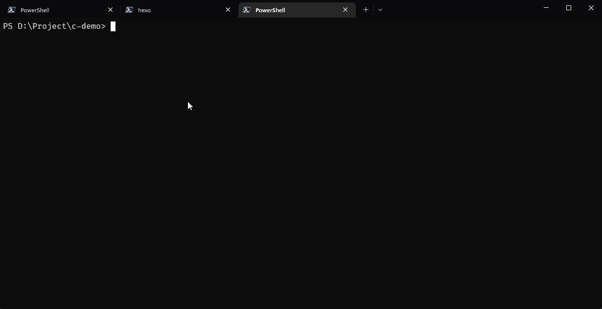
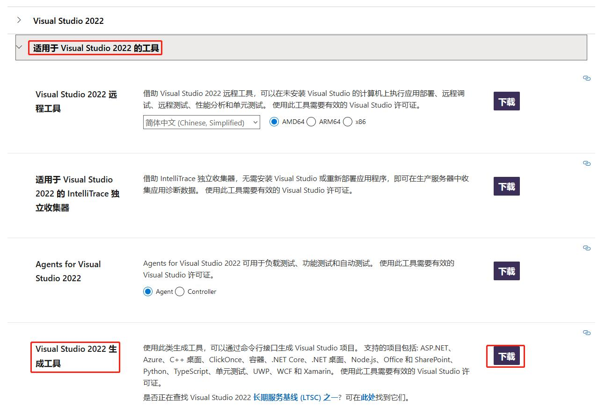
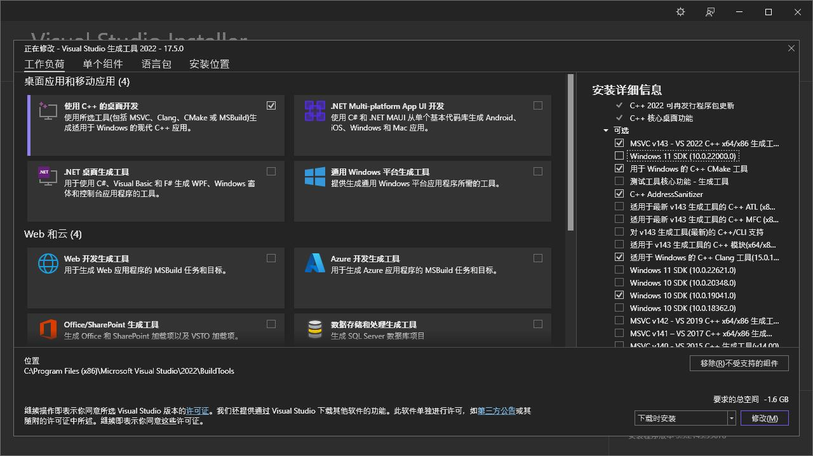

# {{ $frontmatter.title }}

为了与 Linux 拥有一致的开发体验，特在此记录：在 Windows 上使用 Neovim + CMake + MSBuild 搭建 C/C++ 环境。

首先上效果：



> 由于 Neovim 插件和一些配置需要访问[Github](https://github.com/)，若无法访问，请自行百度`科学上网`和`DNS解析`，另不推荐使用镜像站或[Gitee](https://gitee.com/)，因为某些插件可能并没有被同步。

> 本篇文章多次涉及到`环境变量`的设置，关于 Windows 环境变量设置，网上有很多教程，这里不再赘述。并且本文尽量避免环境变量多次生效，先把软件安装好，配置好环境变量后，直接重启电脑。

## 基础软件包安装

本篇文章涉及到的安装方式有3种：

1. 应用商店，可能需要微软账户
2. 普通安装，一般是双击 exe，或者将 exe 文件放到指定目录，也有压缩文件，解压即可
3. 命令行安装，需要先安装微软终端程序

> 建议按本文章先后顺序进行安装。

### 应用商店安装

打开 Microsoft Store，搜索`PowerShell`和`Windows Terminal`，并进行安装。

### 普通安装

#### wget

1. 下载[wget.exe](https://eternallybored.org/misc/wget/)
2. 将`wget.exe`放在`C:\Windows`目录

#### ripgrep

1. 下载[ripgrep](https://github.com/BurntSushi/ripgrep/releases)的 zip 文件
2. 将解压后的文件夹添加进环境变量

#### nvm

1. 下载[nvm-setup.exe](https://github.com/coreybutler/nvm-windows/releases)
2. 双击 exe 文件安装，一直下一步即可

> 不建议更改安装路径，可能涉及权限问题导致后面安装 nodejs 和 npm 比较麻烦。

#### python

1. 下载[python](https://www.python.org/downloads/)
2. 双击 exe 文件安装

> 建议自定义安装，注意勾选`pip`。

#### MSBuild

1. 下载[Visual Studio 2022 生成工具](https://visualstudio.microsoft.com/zh-hans/downloads/)
2. 注意**不是**`Visual Studio 2022`，`Visual Studio 2022`是大家熟悉的 IDE
3. 应该往下拉展开`适用于Visual Studio 2022 的工具`，选择`Visual Studio 2022 生成工具`进行下载

4. 双击 exe 文件进行安装
5. 在弹出的界面，左侧勾选`使用 C++ 的桌面开发`，右侧只需勾选`MSVC v143 *** 生成工具`和`Windows 11/10 SDK`即可


#### CMake

1. 下载[cmake*.msi](https://cmake.org/download/)
2. 双击 msi 文件安装

> 安装时记得勾选将CMake添加进系统环境变量。

### 命令行安装

#### Neovim

查看[Neovim](https://github.com/neovim/neovim/wiki/Installing-Neovim)官方文档，执行：

```powershell
winget install Neovim.Neovim
```

#### Git

查看[Git](https://git-scm.com/download/win)官方文档，执行：

```powershell
winget install --id Git.Git -e --source winget
```

#### nodejs npm

1. nodejs 和 npm 一般是一起安装的，并且使用 nvm 可以多版本管理，但是在安装前要简单配置下
2. 配置一下源地址可以加速下载，特别是中国地区，按[官方文档](https://github.com/coreybutler/nvm-windows#usage)进行配置：

```powershell
nvm node_mirror https://npmmirror.com/mirrors/node/
nvm npm_mirror https://npmmirror.com/mirrors/npm/
```

3. 安装 nodejs 和 npm：
    1. 查看本地已装版本：

    ```powershell
    nvm ls
    ```

    2. 查看远程可用版本：

    ```powershell
    nvm ls available
    ```

    3. 安装最新版本：

    ```powershell
    nvm install 19.4.0
    ```

    4. 安装完会提示使用安装的版本：

    ```powershell
    nvm use 19.4.0
    ```

> 若使用`nvm`命令提示不命令行、函数、脚本或者可执行程序的名称，可能需要重启系统或 Windows 资源管理器

## 开发环境配置

#### Git 配置

1. 配置 Git 代理，执行：

```powershell
git config --global http.proxy http://127.0.0.1:7890
git config --global https.proxy http://127.0.0.1:7890
```

2. 有时配置 ssh key 之后，每次 clone pull push 的时候还是提示输入密码，可以参考[官方文档](https://docs.github.com/zh/authentication/troubleshooting-ssh/using-ssh-over-the-https-port)
添加`~/.ssh/config`文件，并且写入：

```powershell
Host github.com
Hostname ssh.github.com
Port 443
User git
```

#### Neovim 配置

1. Neovim 配置对于刚接触的人可能比较复杂，其实就是配置一些插件，大部分插件的 github 都有其使用说明，这里为了方便，可以直接使用本人的[配置](https://github.com/Groveer/dotfiles/tree/master/nvim)，并且这里也对该配置的快捷键进行了说明，执行：

```powershell
git clone https://github.com/Groveer/dotfiles.git
```

2. 创建软件，Neovim 读取配置是在固定的目录：

```powershell
mklink /d C:\Users\grove\AppData\Local\nvim D:\Project\dotfiles\nvim
```

其中，`grove`是本地账户名，`D:\Project\dotfiles`是 git clone 下来的项目，dotfiles 项目是本人在 Linux 下的[个人配置](https://github.com/Groveer/dotfiles)，有兴趣的可以看看

3. 本人的 Neovim 配置使用 Packer 进行插件管理，首次启动 Neovim 会报错，忽略错误可进行插件安装：

```powershell
nvim
```

4. 若部分插件安装失败，可重新执行命令进行更新：

```powershell
:PackerSync
```

5. 一般来说，进行了上面的软件安装，Neovim 所需的程序就齐全了，当然也可以执行命令进行检查：

```powershell
:checkhealth
```

6. 若 Lsp 提示安装失败，可查看日志，然后根据日志内容进行修复：

```powershell
:MasonLog
```

> 本人在某次安装过程中，发现某个 lsp 无法安装，通过日志查看是某个目录无法删除，打开 Windows 文件管理器进行删除，提示某个程序正在占用，也不想继续排查是哪个程序占用，直接重启电脑，然后再次打开`nvim`，就正常了。

#### 扩展字体配置

1. 下载[FiraCode](https://github.com/ryanoasis/nerd-fonts/releases/download/v2.3.0/FiraCode.zip)字体
2. 解压文件后全选 ttf 文件，然后右键安装
3. 终端：设置->默认值->字体，选择`FiraCode Nerd Font Mono Retina`，保存弹窗提示忽略
4. 重启终端，进入 nvim，正常显示图标字体

> 在配置过程中若遇到什么问题，可在博客下方进行留言。
